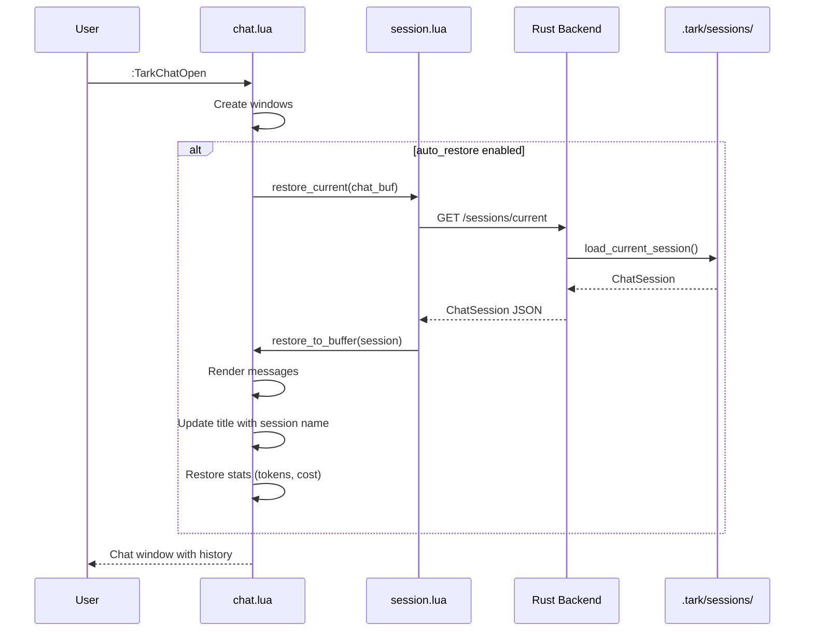
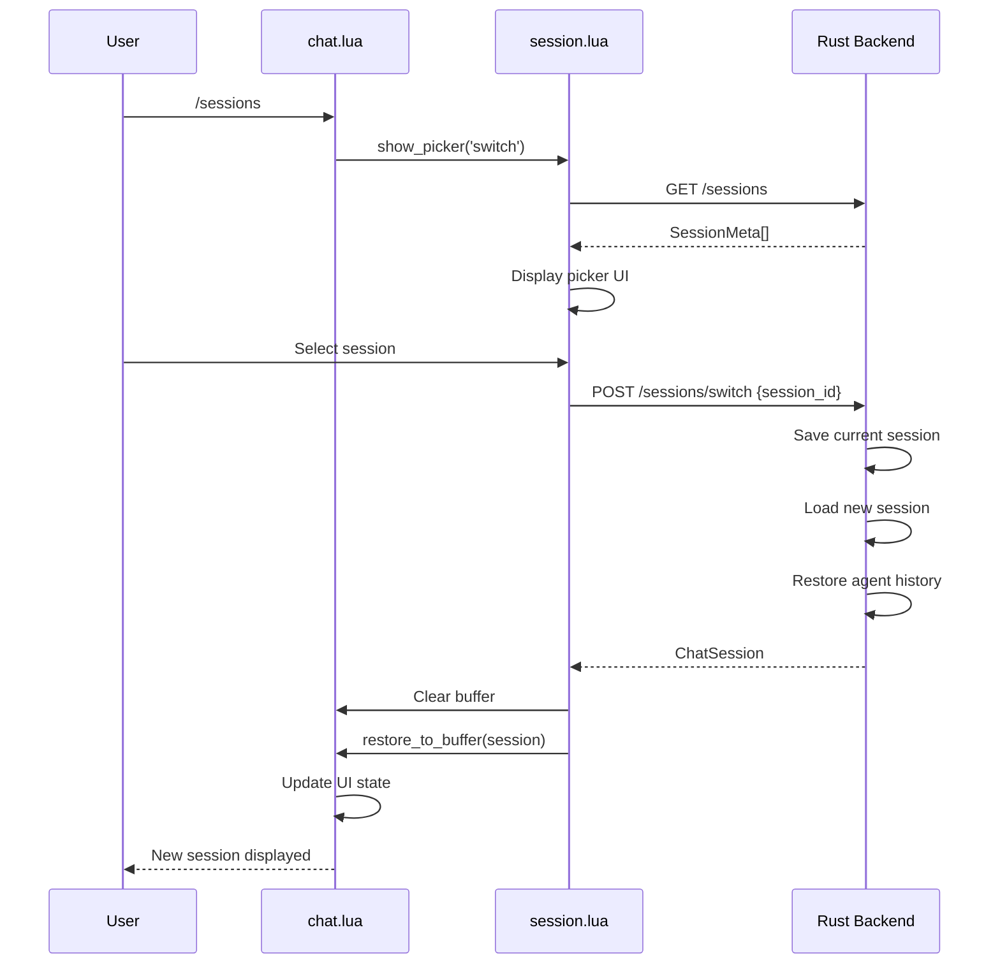

# Design Document: Chat Session Restore

## Overview

This design implements automatic chat session restoration and management for tark's Neovim plugin. The feature leverages the existing Rust backend session APIs while adding a new Lua-side session management layer to handle UI state, auto-restore logic, and user interactions.

The architecture follows tark's existing patterns: the Rust backend handles persistence and agent state, while the Lua frontend manages UI and user interactions via HTTP API calls.

## Architecture

```
┌─────────────────────────────────────────────────────────────────┐
│                     Neovim Plugin (Lua)                         │
├─────────────────────────────────────────────────────────────────┤
│  lua/tark/                                                      │
│  ├── chat.lua          # Chat UI (modified)                     │
│  │   ├── Session indicator in title                             │
│  │   ├── Auto-restore on open                                   │
│  │   └── Slash commands (/sessions, /new, /delete)              │
│  │                                                              │
│  └── session.lua       # NEW: Session management module         │
│      ├── fetch_sessions()     # GET /sessions                   │
│      ├── fetch_current()      # GET /sessions/current           │
│      ├── switch_session(id)   # POST /sessions/switch           │
│      ├── create_session()     # POST /sessions/new              │
│      ├── delete_session(id)   # POST /sessions/delete           │
│      └── restore_to_buffer()  # Render messages to chat buffer  │
└─────────────────────────────────────────────────────────────────┘
                              │
                              │ HTTP API
                              ▼
┌─────────────────────────────────────────────────────────────────┐
│                     Rust Backend (existing)                     │
├─────────────────────────────────────────────────────────────────┤
│  src/transport/http.rs                                          │
│  ├── GET  /sessions           # List workspace sessions         │
│  ├── GET  /sessions/current   # Get current session data        │
│  ├── POST /sessions/switch    # Switch to session               │
│  ├── POST /sessions/new       # Create new session              │
│  └── POST /sessions/delete    # Delete session                  │
│                                                                 │
│  src/storage/mod.rs                                             │
│  ├── ChatSession struct       # Session data model              │
│  ├── save_session()           # Persist to .tark/sessions/      │
│  ├── load_session()           # Load from disk                  │
│  └── list_sessions()          # List workspace sessions         │
└─────────────────────────────────────────────────────────────────┘
                              │
                              ▼
┌─────────────────────────────────────────────────────────────────┐
│                     File System                                 │
├─────────────────────────────────────────────────────────────────┤
│  .tark/sessions/                                                │
│  ├── current                  # Current session ID pointer      │
│  ├── session_20241230_*.json  # Session data files              │
│  └── ...                                                        │
└─────────────────────────────────────────────────────────────────┘
```

## Components and Interfaces

### 1. Session Module (`lua/tark/session.lua`)

New module responsible for session lifecycle management.

```lua
-- Session module interface
local M = {}

-- Configuration (merged from tark.config.chat.session)
M.config = {
    auto_restore = true,      -- Auto-load previous session on chat open
    max_sessions = 50,        -- Max sessions per workspace
    save_on_close = true,     -- Save session when chat closes
}

-- Current session state
M.current_session = nil       -- Cached session data

-- Fetch all sessions for current workspace
-- Returns: {sessions: SessionMeta[], error: string|nil}
function M.fetch_sessions() end

-- Fetch current session with full data
-- Returns: {session: ChatSession|nil, error: string|nil}
function M.fetch_current() end

-- Switch to a different session
-- @param session_id string
-- Returns: {session: ChatSession|nil, error: string|nil}
function M.switch_session(session_id) end

-- Create a new session
-- Returns: {session: ChatSession|nil, error: string|nil}
function M.create_session() end

-- Delete a session
-- @param session_id string
-- Returns: {success: boolean, error: string|nil}
function M.delete_session(session_id) end

-- Restore session messages to chat buffer
-- @param session ChatSession
-- @param chat_buf number Buffer handle
function M.restore_to_buffer(session, chat_buf) end

-- Show session picker UI
-- @param on_select function(session_id) Callback when session selected
-- @param mode string 'switch' or 'delete'
function M.show_picker(on_select, mode) end

return M
```

### 2. Chat Module Modifications (`lua/tark/chat.lua`)

Modifications to integrate session management:

```lua
-- New config options in M.config
M.config = {
    -- ... existing config ...
    session = {
        auto_restore = true,
        max_sessions = 50,
        save_on_close = true,
    },
}

-- Modified M.open() to auto-restore
function M.open()
    -- ... existing window creation ...
    
    if M.config.session.auto_restore then
        local session_mod = require('tark.session')
        session_mod.restore_current(chat_buf)
    end
end

-- Modified M.close() to save session
function M.close()
    if M.config.session.save_on_close then
        -- Session is auto-saved by backend on each message
        -- Just update the current pointer
    end
    -- ... existing close logic ...
end

-- New slash commands
slash_commands['/sessions'] = function() ... end
slash_commands['/new'] = function() ... end
slash_commands['/delete'] = function() ... end
```

### 3. Session Picker UI

Floating window for session selection, reusing existing `vim_select` pattern:

```lua
-- Session picker display format
-- ┌─ Sessions ─────────────────────────────────┐
-- │ ● Current session name...        12 msgs   │
-- │   Previous session...             8 msgs   │
-- │   Another conversation...         3 msgs   │
-- │                                            │
-- │ j/k:move  Enter:select  d:delete  q:close  │
-- └────────────────────────────────────────────┘
```

## Data Models

### SessionMeta (from backend)

```lua
-- Lightweight session info for listing
{
    id = "session_20241230_143022_123",
    name = "Implement feature X...",
    created_at = "2024-12-30T14:30:22Z",
    updated_at = "2024-12-30T15:45:00Z",
    provider = "openai",
    model = "gpt-4o",
    mode = "build",
    message_count = 12,
    is_current = true,
    agent_running = false,
}
```

### ChatSession (from backend)

```lua
-- Full session data for restore
{
    id = "session_20241230_143022_123",
    name = "Implement feature X...",
    created_at = "2024-12-30T14:30:22Z",
    updated_at = "2024-12-30T15:45:00Z",
    provider = "openai",
    model = "gpt-4o",
    mode = "build",
    window_style = "sidepane",
    window_position = "right",
    messages = {
        { role = "user", content = "...", timestamp = "..." },
        { role = "assistant", content = "...", timestamp = "..." },
    },
    input_tokens = 1500,
    output_tokens = 2300,
    total_cost = 0.0234,
}
```


## Sequence Diagrams

### Auto-Restore on Chat Open



### Session Switch Flow



## Error Handling

| Error Scenario | Handling |
|----------------|----------|
| Server not running | Show notification, skip restore, allow fresh start |
| Session file corrupted | Log warning, create new session |
| Network timeout | Retry once, then show error notification |
| No sessions exist | Create new empty session automatically |
| Delete current session | Switch to most recent, or create new if none |

## Testing Strategy

### Unit Tests

- Session module API functions (mock HTTP responses)
- Message rendering to buffer
- Session picker UI interactions
- Config option handling

### Integration Tests

- Full restore flow with real backend
- Session switching preserves agent context
- Workspace isolation (sessions don't leak between projects)

### Manual Testing Checklist

- [ ] Open chat in new workspace → creates new session
- [ ] Close and reopen chat → restores previous session
- [ ] `/sessions` shows picker with correct sessions
- [ ] Switch session → history changes, agent context restored
- [ ] `/new` creates fresh session, saves previous
- [ ] `/delete` removes session, handles current session deletion
- [ ] Session name shows in title bar
- [ ] Token stats restored correctly


## Correctness Properties

*A property is a characteristic or behavior that should hold true across all valid executions of a system—essentially, a formal statement about what the system should do. Properties serve as the bridge between human-readable specifications and machine-verifiable correctness guarantees.*

### Property 1: Session Restore Round-Trip

*For any* valid ChatSession with messages, settings (provider, model, mode), and statistics (tokens, cost), saving the session and then restoring it SHALL produce an equivalent session state with all data preserved.

**Validates: Requirements 1.4, 1.5, 1.6**

### Property 2: Workspace Isolation

*For any* workspace directory, the Session_Manager SHALL only return sessions whose files exist in that workspace's `.tark/sessions/` directory, and SHALL NOT return sessions from any other workspace.

**Validates: Requirements 2.1, 2.2, 2.3**

### Property 3: Save-Before-Switch Invariant

*For any* session switch or new session creation operation, the current session's state at the time of the operation SHALL be persisted to disk before the operation completes.

**Validates: Requirements 3.4, 4.2**

### Property 4: Session Deletion Removes File

*For any* session deletion operation, the session file SHALL no longer exist in the `.tark/sessions/` directory after the operation completes.

**Validates: Requirements 5.2**

### Property 5: Delete Current Session Fallback

*For any* deletion of the current session where other sessions exist, the Session_Manager SHALL switch to the most recently updated remaining session.

**Validates: Requirements 5.3**

### Property 6: Max Sessions Cleanup

*For any* workspace where the number of sessions exceeds `max_sessions`, the Session_Manager SHALL delete the oldest sessions (by `updated_at`) until the count equals `max_sessions`.

**Validates: Requirements 7.3**

### Property 7: Auto-Save on Message

*For any* chat message sent or received, the session file's `updated_at` timestamp SHALL be more recent than before the message was processed.

**Validates: Requirements 8.1**

### Property 8: Session Name Truncation

*For any* session name longer than the display limit, the displayed name SHALL be truncated and end with ellipsis ("..."), and the truncated length SHALL not exceed the display limit.

**Validates: Requirements 6.2**

