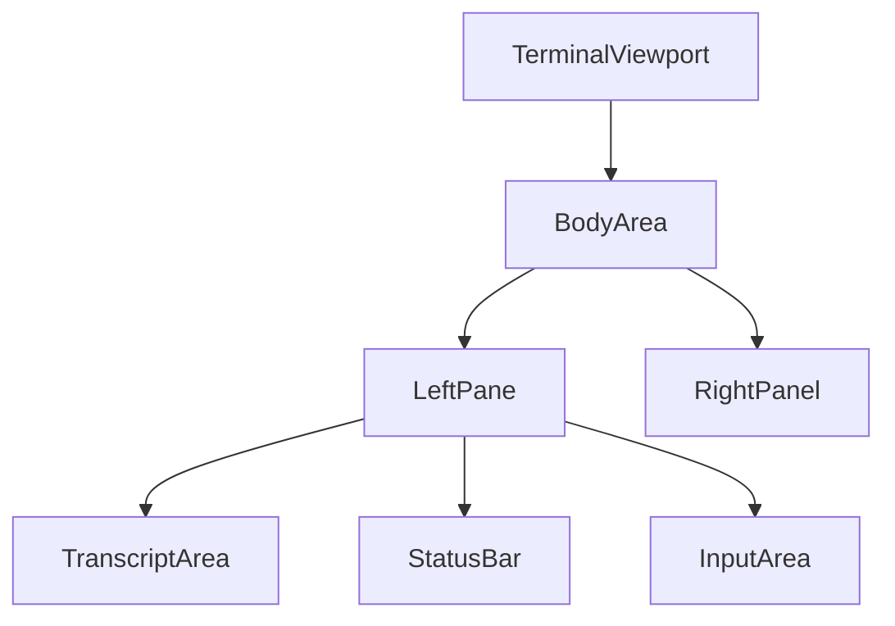

# TUI Plan: Match Prototype Screenshot (Terminal + Panel)

## Summary (what we are building)
We will restyle and slightly re-layout `tark`’s existing **ratatui** TUI so it visually matches the prototype screenshot (Terminal transcript on the left, collapsible “Panel” on the right, bottom status bar, and distinct message-type styling).

This plan assumes:
- **Truecolor** terminal (24-bit color)
- **Nerd Font** icons available (we will still provide graceful fallbacks)
- Layout choice: **full-height left pane** (not a centered card)

The goal is “as close as a terminal allows”. We cannot reproduce true shadows/blur/rounded CSS corners, but we can get very close with:
- box drawing borders
- consistent spacing
- a GitHub-dark color palette
- deliberate typography using bold/dim modifiers

## Source of truth for the look
- The prototype screenshot you provided
- The prototype code bundle (for reference only): `/tmp/tark-design/src/app/components/Terminal.tsx` and `/tmp/tark-design/src/app/components/Sidebar.tsx`

## Where this lands in `tark`
`src/tui/*` already contains almost all required structure. We are primarily doing **design + formatting + styling**.

Key existing building blocks:
- Layout orchestration: `src/tui/app.rs`
- Right panel widget & state machine (accordion + scrolling): `src/tui/widgets/panel.rs`
- Bottom status bar widget: `src/tui/widgets/status_bar.rs`
- Transcript rendering: `src/tui/widgets/message_list.rs`, plus `src/tui/widgets/tool_block.rs` and `src/tui/widgets/thinking_block.rs`
- Input editor: `src/tui/widgets/input.rs`
- Theme/config glue: `src/tui/config.rs`

## Deliverables
- A new “prototype-like” theme in `tark`’s TUI theme config
- Updated layout and widget styles to match the screenshot:
  - Left transcript + input area styling
  - Right panel visuals and icons
  - Status bar formatted like the screenshot
- Updated/added tests to prevent style regressions
- Docs note: Truecolor + Nerd Font recommended for best visuals

## Constraints and “don’t break”
- Do **not** break non-truecolor terminals; default theme should remain usable.
- Do **not** remove existing keybindings. If we add new ones, document them and keep defaults.
- Keep existing behavior for:
  - plan/task tracking
  - panel navigation
  - input editing and history
  - tool approval UX

## Visual spec (map screenshot → TUI components)

### A) Global palette (GitHub-dark-ish)
We want these “feels”:
- Background: near-black/very dark blue (`#0d1117` feel)
- Surface: slightly lighter panels (`#161b22` feel)
- Borders: subtle lines (`#30363d` feel)
- Muted text: gray
- Accents:
  - System: cyan
  - Input/user: purple
  - Tool invocation: indigo
  - “Build mode”: amber/green hints (but keep consistent with existing `AgentMode` colors)
  - Tasks active highlight: amber

**Implementation rule**: centralize these colors in `src/tui/config.rs` (`ThemeColors`). Do NOT sprinkle hardcoded `Color::Rgb(...)` everywhere.

### B) Layout spec
Split the terminal viewport into:
- Left: transcript + input (full height)
- Right: “Panel” (full height), with a vertical separator/border

Suggested proportions:
- Panel width: ~35–40 columns (configurable)
- Left: remaining width

`src/tui/widgets/panel.rs` already supports a fixed width; use that rather than ad-hoc layout math.

#### B.1 Layout diagram (exact regions)



#### B.1a ASCII layout (copy/paste visual target)

```text
┌───────────────────────────────────────────────────────────────────────┬──────────────────────────────┐
│                               Transcript                               │            Panel             │
│                                                                         │ ───────────────────────────  │
│  ● System: Tank [07:09]                                                 │ ▼ Session              (n)   │
│  $ > overview ...                                                       │   main                     │
│    I've scanned the codebase...                                         │   feature/sidebar-update    │
│                                                                         │   model/provider            │
│  ┌ Tool Invocation ─────────────────────────────────────────────────┐   │   $0.015 (3 models)  ▼     │
│  │ EXEC: rg -n \"...\"                                                │   │     gemini...  $0.012     │
│  └───────────────────────────────────────────────────────────────────┘   │     ...                    │
│                                                                         │ ▼ Context              (1.0k)│
│                                                                         │   1,833 / 1,000,000 tokens  │
│                                                                         │   Loaded Files (8)          │
│                                                                         │     src/...                 │
│                                                                         │ ▼ Tasks                (8)  │
│                                                                         │   ● Understanding... Active │
│                                                                         │   Queued                    │
│                                                                         │   ○ Which is the most...    │
│                                                                         │ ▼ Git Changes          (12) │
│                                                                         │   7 Mod | 3 New | 2 Del     │
│                                                                         │   M src/... (+45 -12)       │
├───────────────────────────────────────────────────────────────────────┴──────────────────────────────┤
│  ◆ Build  │  [Claude 3.5 Sonnet | Anthropic]  │  [12%] 5K/128K  │  $0.015  │  ● nvim               │
├───────────────────────────────────────────────────────────────────────────────────────────────────────┤
│  +  [INSERT]  Send a message to Build agent...                                                     │
└───────────────────────────────────────────────────────────────────────────────────────────────────────┘
```

Notes:
- Left pane: transcript (scrolling), then status bar (1 row), then input (1–3 rows).
- Right pane: fixed-width panel (~35–40 cols) with collapsible sections.

#### B.2 Ratatui constraints (copy/paste target behavior)
File to implement: `src/tui/app.rs`

**Top-level horizontal split** (full-height left + fixed-width right):
- `left.width = remaining`
- `right.width = panel_width` (from config; default 35–40)

**Left pane vertical split** (transcript above, status bar, input at bottom):
- `transcript.height = remaining`
- `status.height = 1`
- `input.height = min(3, available)` (or a dynamic height based on multiline input; but keep a minimum of 1)

If your current TUI already places status bar elsewhere, adjust the vertical order to match the screenshot-like mental model:
- transcript occupies the majority
- a single-line status bar separates transcript and input
- input sits at the bottom

#### B.3 Rendering order (important)
Render in this order to avoid “overdraw” artifacts in ratatui:
1. Fill base background (theme background) for the full viewport
2. Draw borders/separators (vertical separator between panes; horizontal separator in left pane)
3. Render transcript widget into `transcript`
4. Render right panel widget into `rightPane`
5. Render status bar into `status`
6. Render input widget into `input`
7. Render popups/overlays last (help, approval, selectors) so they appear on top

#### B.4 Separator style rules
Use a subtle border color (theme `border`) with box drawing:
- Vertical divider: `│` column (or a `Block` with right/left border)
- Horizontal divider: `─` row (or a `Block` border)

Do **not** use “heavy” borders everywhere; the screenshot uses quiet separators.

#### B.5 Minimum-size behavior (do not crash)
If terminal is too small:
- If `width < panel_width + minimum_left_width`, automatically hide/collapse the right panel.
- If `height < 6`, render a simplified view (e.g., only input + a short message) instead of panicking.

### C) Transcript visual rules
We want the same semantic styling as the prototype:
- **System**: cyan dot + cyan name/time prefix
- **Tool invocation**: an indigo-tinted block with a left bar indicator
- **Command**: `$` prompt prefix + brighter command text
- **Output**: dim gray, preserve whitespace and wrapping
- **User input**: purple `›` prefix + purple-ish text
- **Assistant output**: standard white/gray

### D) Status bar rules
Bottom bar should be visually quiet:
- Left: mode indicator (colored) + trust level indicator (Build only)
- Middle/right: model/provider “pill” style (using brackets and padding)
- Keep: tokens usage + cost + editor connection indicator

### E) Panel rules
The right “Panel” should match the screenshot’s hierarchy:
- Header: “Panel” title + collapse/expand affordances
- Sections: Session / Context / Tasks / Git

Important: current `tark` panel already supports:
- Session / Context / Tasks / Modified Files

We can either:
- keep “Modified Files” but adjust title to “Git Changes” if it’s more consistent with `tark`
- or keep “Modified Files” and style similarly (the screenshot shows git changes, which is conceptually similar)

Also:
- When an active task exists, highlight Tasks header (amber), similar to screenshot.
- Use Nerd Font glyphs for icons; fallback to ASCII if glyph is not available.

## Step-by-step implementation guide (do exactly in this order)

### Step 0: Baseline understanding (read-only)
Before changing anything, skim these files to understand current structure:
- `src/tui/app.rs` (where layout is assembled)
- `src/tui/config.rs` (theme + config types)
- `src/tui/widgets/panel.rs` (already quite close to desired right panel)
- `src/tui/widgets/status_bar.rs`
- `src/tui/widgets/message_list.rs`
- `src/tui/widgets/tool_block.rs`
- `src/tui/widgets/thinking_block.rs`
- `src/tui/widgets/input.rs`

Write down:
- where colors are currently sourced
- how layout is computed (ratatui `Layout` usage)
- how message types are identified (roles/types)

### Step 1: Add a “prototype” theme to config
File: `src/tui/config.rs`

Goal: define a new theme preset, for example:
- name: `prototype_dark` (or similar)
- colors: background, surface, border, text_primary, text_muted, cyan, purple, indigo, amber

Guidelines:
- Expose colors through `ThemeColors` so widgets can do: `theme.colors.border`, etc.
- Add **one** function like `ThemeConfig::prototype_dark()` or a config enum variant.
- Do not remove existing themes or defaults.

Acceptance criteria:
- You can instantiate the theme from configuration (or set it as a selectable theme).
- No widget imports raw RGB colors directly (except inside theme definition).

### Step 2: Layout (two-pane full-height)
File: `src/tui/app.rs`

Goal: make the core layout stable and match screenshot:
- Vertical split: left main area + right panel
- Left area: transcript region above, input below
- Ensure consistent borders:
  - subtle vertical separator between left and right
  - subtle horizontal separator between transcript and input

Implementation notes:
- Prefer ratatui `Layout::horizontal([Constraint::Min(..), Constraint::Length(panel_width)])`
- Feed panel width from config (and/or panel widget’s width setting) rather than hardcoding.

Acceptance criteria:
- On terminal resize, layout remains stable.
- Panel always stays visible (unless user toggles it).
- Input stays at bottom and does not overlap transcript.

### Step 3: Transcript styling (message list)
Files:
- `src/tui/widgets/message_list.rs`
- `src/tui/widgets/tool_block.rs`
- `src/tui/widgets/thinking_block.rs`

Goal: implement screenshot-like formatting:

#### 3.1 Message type mapping table
Create (or refactor into) a single function that maps message content → display style, e.g.:
- `fn style_for_role(role: Role, theme: &ThemeConfig) -> Style`
- `fn prefix_for_message(msg: &ChatMessage) -> Vec<Span>`

Rules:
- System:
  - prefix: `●` (or Nerd Font small circle)
  - color: cyan
  - name/time should be emphasized if present
- Tool invocation:
  - render as a block with a left bar (use box drawing `│` and background tint if feasible)
  - color: indigo accent for header label
- Command:
  - prefix: `$`
  - command text: brighter than output
- Output:
  - dim gray
  - preserve whitespace wrapping as much as possible
- User input:
  - prefix: `›`
  - purple

#### 3.2 Keep wrapping + scroll behavior correct
Don’t regress scroll/backtracking:
- ensure that “styled spans” still count width correctly
- don’t break selection/cursor offsets if they exist

Acceptance criteria:
- Mixed transcript (system/tool/output/input) is readable and stable.
- Tool invocation blocks clearly stand out.

### Step 4: Status bar restyle
File: `src/tui/widgets/status_bar.rs`

Goal: match screenshot feel:
- mode indicator on left (colored)
- model/provider displayed like a “pill” (brackets + spacing + possibly background)
- keep tokens/cost/editor connected, but make them less visually noisy

Implementation notes:
- Keep logic, change formatting.
- Avoid hard-coded widths that will overflow; truncate model/provider if needed.
- Use theme colors rather than raw `Color::...`.

Acceptance criteria:
- On narrow terminals, status bar doesn’t panic and truncates gracefully.
- On wide terminals, it looks like the screenshot’s bottom bar structure.

### Step 5: Panel parity (right sidebar)
File: `src/tui/widgets/panel.rs`

Good news: this file already implements many screenshot features:
- accordion sections
- scrollbars
- session info + cost breakdown
- tasks list
- progress bar for context

We will change primarily:

#### 5.1 Colors + iconography
- Replace emojis with Nerd Font glyphs (and provide fallback).
- Use GitHub-dark palette from theme config.

#### 5.2 Tasks header highlight when active
Add a clear rule:
- if there is at least one `TaskStatus::Running`, render the Tasks section header in amber.

Where to implement:
- in `render_section_header(...)` call site for Tasks, pass `has_unread` or add a new `is_attention` bool.

#### 5.3 Optional: Git naming
Decide whether to rename “Modified Files” section title to “Git Changes”.
- Only do this if it doesn’t mislead (if data truly comes from git).
- If data is “modified files tracked by plan/editor”, keep it as “Modified Files” and just style it similarly.

Acceptance criteria:
- Panel looks modern: muted text, tight spacing, consistent borders.
- Active tasks draw attention like screenshot.

### Step 6: Tests (regression protection)
Files (new or existing):
- likely `src/tui/widgets/panel.rs` tests (already has many)
- add tests in message/status widgets if absent

Add tests for:
- **panel highlight**: Tasks header style changes when a running task exists
- **message mapping**: given a message type/role, the chosen prefix and color are correct
- **status bar truncation**: long model/provider doesn’t overflow; verify produced spans are within area width (where possible)

Acceptance criteria:
- Tests fail before change (if you write them first) and pass after.
- `cargo test --all-features` passes.

### Step 7: Docs update
Update a user-facing doc (choose one):
- `README.md` (TUI section), or
- `AGENTS.md` if that’s where TUI behavior is documented

Add:
- “Best experience: truecolor terminal + Nerd Font”
- optionally list recommended fonts/settings

### Step 8: Mandatory workflow checks (must be last)
Run exactly:
- `cargo build --release`
- `cargo fmt --all`
- `cargo fmt --all -- --check`
- `cargo clippy --all-targets --all-features -- -D warnings`
- `cargo test --all-features`

If any step fails:
- fix and rerun from the failing step onward until all pass.

## Suggested Nerd Font glyphs (with fallbacks)
Use these only if you confirm they render well; otherwise fallback.

- Terminal icon: `󰆍` or fallback `>`
- Circle dot: `` or fallback `●`
- Chevron: `` / `` or fallback `▼` / `▶`
- Branch: `` or fallback `⎇`
- Cloud: `` or fallback `☁`
- Cost/money: `` or fallback `$`
- Tasks: `` or fallback `⏱`
- Git: `` or fallback `git`

Implementation hint: define a small `icons` module (or struct) returning `&'static str` for each, and pick fallback based on config (not runtime font detection).

## Agent instructions (for “dumb” agents)
When implementing:
- Make **small commits** per step (theme, layout, transcript, status bar, panel, tests, docs).
- Do not mix formatting changes with logic changes unless necessary.
- After each step, run the smallest relevant tests (then run the full workflow at the end).

